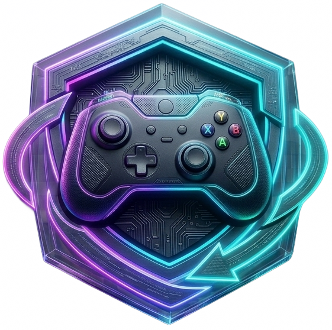
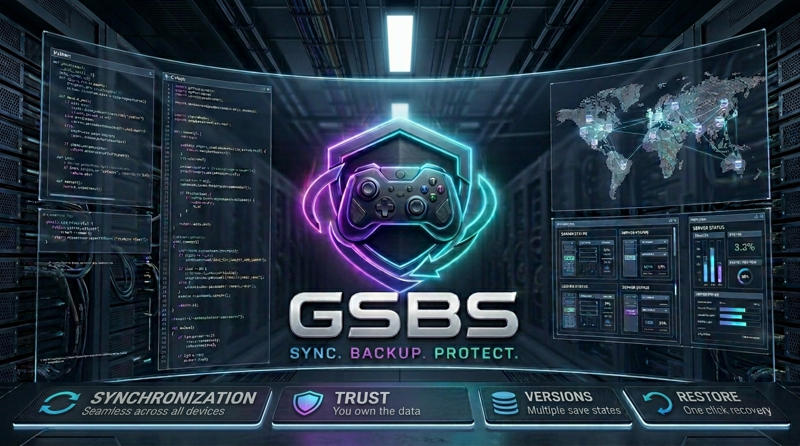
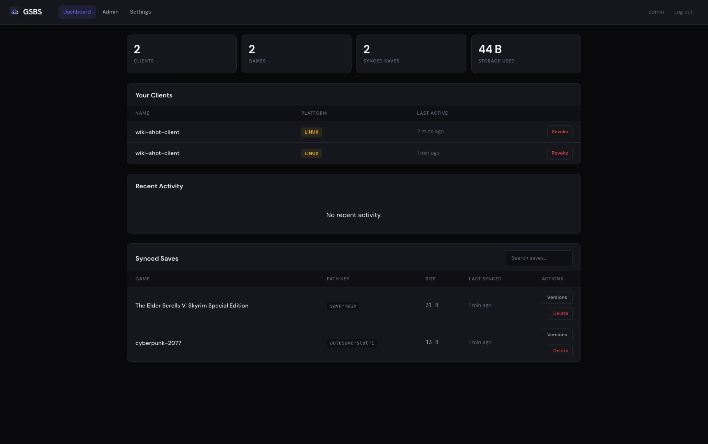

<h1 align="center">
  
  &nbsp;GSBS — Game Sync &amp; Backup Service
</h1>

[](https://github.com/dlommm/GSBS-Game-Sync-Backup-Service/actions/workflows/ci.yml)
[](https://github.com/dlommm/GSBS-Game-Sync-Backup-Service/actions/workflows/codeql.yml)
[](https://github.com/dlommm/GSBS-Game-Sync-Backup-Service/actions/workflows/release.yml)
[](https://goreportcard.com/report/github.com/gsbs/gsbs)
[](LICENSE)
[](https://hub.docker.com/r/dendlomm/gsbs-server)
[](https://github.com/dlommm/GSBS-Game-Sync-Backup-Service/releases/latest)

<p align="center">
  
</p>

<p align="center"><strong>SYNC. BACKUP. PROTECT.</strong> — keep your game saves synced and safe across every device.</p>

<table align="center">
  <tr>
    <td align="center" bgcolor="#4338ca">
      <strong>🚀 GSBS v4 — Major release</strong><br>
      Zero-config setup wizard · game-aware sync (pause while playing) · built-in offsite backups + one-command restore · notifications · save export/import · end-to-end encryption upgraded to Argon2id · macOS + arm64 clients
    </td>
  </tr>
</table>

**Sync game saves across Windows, Linux, and macOS.** Run a central server, install clients on each PC, and GSBS keeps saves in sync — only writing pulled files where the game is actually installed, and pausing while a game is running so it never touches a live save.

### Why GSBS?

| | **GSBS** | Ludusavi | Syncthing | Steam Cloud |
|---|---|---|---|---|
| Multi-device **live sync** | ✅ central server | ❌ local backup only | ✅ generic file sync | ✅ (Steam games only) |
| Knows *where* each game saves | ✅ PCGamingWiki manifest | ✅ | ❌ you configure paths | ✅ (Steam only) |
| Cross-OS path translation | ✅ Windows ↔ Linux ↔ Proton | ✅ | ❌ | n/a |
| Version history + restore | ✅ per-file | ✅ | ⚠️ file versioning | ⚠️ limited |
| Pause sync while playing | ✅ | n/a | ❌ | ✅ |
| End-to-end encryption | ✅ optional (Argon2id) | ❌ | ✅ | ❌ |
| Web dashboard | ✅ | ❌ (GUI/CLI) | ✅ | ❌ |
| Self-hosted / your data | ✅ | ✅ | ✅ | ❌ Valve-hosted |
| Any game (not just Steam) | ✅ | ✅ | ✅ | ❌ |

GSBS is a *hosted, multi-client, versioned save-sync service* — the combination Ludusavi (local backup), Syncthing (generic P2P), and Steam Cloud (Steam-only, Valve-hosted) each cover only part of.

| Dashboard | System tray |
|-----------|-------------|
|  |  |

## Quick install

### 1. Server (Docker Compose — recommended)

```bash
git clone https://github.com/dlommm/GSBS-Game-Sync-Backup-Service.git
cd GSBS-Game-Sync-Backup-Service   # folder name matches the GitHub repo name
docker compose up -d
```

No configuration needed — GSBS generates its own secret and opens a **setup wizard** in your browser where you create the admin account. Open `https://your-domain` (via Caddy) or use [docker-compose.dev.yml](docker-compose.dev.yml) for local HTTP on port 8080. See [docs/COMPOSE.md](docs/COMPOSE.md) and [docs/INSTALL.md](docs/INSTALL.md).

On first boot, fresh installs fetch the **S3 manifest bundle** automatically — the full PCGW catalog is ready in minutes, not days.

Windows hosts can also use `gsbs-server-setup-X.Y.Z-windows-amd64.exe` from Releases. The wizard writes `C:\ProgramData\GSBS\server.env`, installs/runs a Windows Service by default, and keeps ProgramData data on uninstall by default.

### 2. Client

Download the latest release for your platform from [GitHub Releases](https://github.com/dlommm/GSBS-Game-Sync-Backup-Service/releases/latest):

| Platform | Install |
|----------|---------|
| **Windows** | Run `gsbs-client-setup-X.Y.Z-windows-amd64.exe` |
| **Linux (Flatpak — recommended for Steam Deck / immutable distros)** | `flatpak remote-add --if-not-exists gsbs https://dlommm.github.io/gsbs-flatpak/repo/gsbs.flatpakrepo && flatpak install gsbs io.github.dlommm.GSBS` |
| **Linux (Debian/Ubuntu)** | `sudo dpkg -i gsbs-client_X.Y.Z_amd64.deb` |
| **Linux (portable)** | `chmod +x gsbs-client-X.Y.Z-x86_64.AppImage && ./gsbs-client-*.AppImage` |

Sign in via the tray menu (**Login…**), point at your server URL, and syncing starts automatically. Clients check for updates daily from GitHub Releases.

### 3. First sync

Register on the server WebUI, create an API token, and log in from the client. GSBS discovers installed games, watches save folders, and uploads changes. New machines pull existing saves when the target folder exists.

## Features

- **Multi-user, multi-device** — many users, each with multiple clients (desktop + laptop + Steam Deck).
- **Game-aware sync** — detects running games and defers sync until you quit, so a live save is never touched mid-session.
- **Auto-discovery** — scans Steam, Epic, GOG, Ubisoft, EA, Xbox, Heroic, Lutris, Bottles, Prism against the PCGamingWiki manifest.
- **OS-aware paths** — `%USERPROFILE%`, Steam libraries, Proton `compatdata`, cross-OS Windows ↔ Linux translation.
- **Version history + restore** — every save is versioned; restore any file from the web dashboard.
- **End-to-end encryption** — optional client-side AES-256-GCM (Argon2id); the server only ever sees ciphertext.
- **Built-in backups + restore** — scheduled `tar.zst` snapshots (DB + keys + saves) to local disk and/or S3, with `gsbs-server restore`.
- **Notifications** — webhook / Discord / ntfy alerts for conflicts, quota, new devices, backups, and stale devices.
- **Export / import** — download real save archives (per game or whole account) and re-import them anywhere.
- **Offline queue** — failed uploads persist and retry automatically; conflicts surface in the tray.
- **Zero-config setup** — no required env vars; a browser wizard creates the admin account on first run.
- **Light/dark web UI + admin**, **OpenAPI spec** at `/api/openapi.json`, and a localization framework.
- **Clients for Windows, Linux (incl. Flatpak / arm64), and macOS.**

See [CHANGELOG.md](CHANGELOG.md) for the full v4 release notes and [docs/ARCHITECTURE.md](docs/ARCHITECTURE.md) for how conflict resolution and encryption work.

The save-location manifest comes from PCGamingWiki — fresh installs pull a pre-built bundle (full ~40k-game catalog in one fetch); switch to live API sync anytime in **Admin → Settings**. The official bundle is published weekly by [VPS-Sync-GSBS](https://github.com/dlommm/VPS-Sync-GSBS). See [docs/MANIFEST_BUNDLE.md](docs/MANIFEST_BUNDLE.md).

## Documentation

**The canonical user documentation is the [GSBS GitHub Wiki](https://github.com/dlommm/GSBS-Game-Sync-Backup-Service/wiki).** The wiki is automatically synced from `docs/wiki/` in this repository on every push to `main` and on each release tag.

| Wiki page | What it covers |
|---|---|
| [Installation](https://github.com/dlommm/GSBS-Game-Sync-Backup-Service/wiki/Installation) | Server and client install on all platforms |
| [Client Setup & Usage](https://github.com/dlommm/GSBS-Game-Sync-Backup-Service/wiki/Client-Setup-and-Usage) | Tray, auto-discovery, sync behavior, E2E encryption, logs |
| [Server Configuration](https://github.com/dlommm/GSBS-Game-Sync-Backup-Service/wiki/Server-Configuration) | All environment variables, Docker, TLS, admin |
| [How It Works](https://github.com/dlommm/GSBS-Game-Sync-Backup-Service/wiki/How-It-Works) | Architecture, data model, path keys, PCGW, cross-OS sync |
| [Troubleshooting](https://github.com/dlommm/GSBS-Game-Sync-Backup-Service/wiki/Troubleshooting) | Common problems and fixes |
| [Upgrading](https://github.com/dlommm/GSBS-Game-Sync-Backup-Service/wiki/Upgrading) | All upgrade procedures, version notes, rollback |
| [API Reference](https://github.com/dlommm/GSBS-Game-Sync-Backup-Service/wiki/API-Reference) | Full REST API reference |
| [FAQ](https://github.com/dlommm/GSBS-Game-Sync-Backup-Service/wiki/FAQ) | Frequently asked questions |
| [Contributing](https://github.com/dlommm/GSBS-Game-Sync-Backup-Service/wiki/Contributing) | Build from source, tests, conventions |

**In-repo reference docs** (source of truth for the wiki, kept in `docs/`):

| File | Description |
|---|---|
| [docs/COMPOSE.md](docs/COMPOSE.md) | Docker Compose + TLS (Caddy) detail |
| [docs/EXAMPLE_CONFIG.md](docs/EXAMPLE_CONFIG.md) | Client config JSON examples |
| [docs/RELEASE.md](docs/RELEASE.md) | Maintainer release workflow |
| [SECURITY.md](SECURITY.md) | Security policy |

## Build from source

Requires **Go 1.25+** and **Node.js** (for WebUI CSS).

```bash
go mod tidy
./script/build-webui.sh
go build -o gsbs-server ./server
go build -o gsbs-client ./client
```

Run tests: `go test ./server/... ./pkg/... ./client/...`

See [CONTRIBUTING.md](CONTRIBUTING.md) for lint, coverage, and conventions.

## Troubleshooting

| Symptom | Where to look |
|---------|---------------|
| WebUI blank or login fails | [Troubleshooting wiki](https://github.com/dlommm/GSBS-Game-Sync-Backup-Service/wiki/Troubleshooting#server-problems) |
| Client 401 / not syncing | Re-login from tray; check `gsbs.log` — [Troubleshooting wiki](https://github.com/dlommm/GSBS-Game-Sync-Backup-Service/wiki/Troubleshooting#client-problems) |
| No tray icon (Linux) | AppIndicator packages — [Client Setup & Usage wiki](https://github.com/dlommm/GSBS-Game-Sync-Backup-Service/wiki/Client-Setup-and-Usage#linux-requirements) |
| Upgrading server or client | [Upgrading wiki](https://github.com/dlommm/GSBS-Game-Sync-Backup-Service/wiki/Upgrading) |

## Architecture

```
                    ┌─────────────────────────────────────────┐
                    │              GSBS Server                 │
                    │  Auth · WebUI · Save storage · PCGW job  │
                    │         ← S3 manifest bundle             │
                    └─────────────────────────────────────────┘
                                      ▲
              ┌───────────────────────┼───────────────────────┐
              │                       │                       │
        ┌─────┴─────┐           ┌─────┴─────┐           ┌─────┴─────┐
        │  Client   │           │  Client   │           │  Client   │
        │ (Windows) │           │  (Linux)  │           │    …      │
        └───────────┘           └───────────┘           └───────────┘
```

## Repository layout

- `server/` — API, auth, WebUI, PCGW cron job
- `client/` — Windows/Linux tray client (watch, sync, auto-update)
- `pkg/` — shared types, path resolution, PCGW client
- `cmd/` — `pcgw-sync`, `pcgw-fetch`, icon tools
- `script/` — build, release, packaging (Inno Setup, `.deb`, AppImage)
- `docs/` — guides and examples

## Server configuration

PCGW data: fresh installs default to **S3 manifest bundle** sync (`pcgw_sync_source=s3`) — the server fetches a pre-built bundle from public object storage (Cloudflare R2) on a schedule (ETag-aware, versioned `index.json`). Existing installs with PCGW data stay on **API sync** until changed in **Admin → Settings**. See [docs/MANIFEST_BUNDLE.md](docs/MANIFEST_BUNDLE.md).

Bundle fetch cron defaults to weekly Monday 03:00 (`GSBS_PCGW_BUNDLE_CRON`). API sync schedule: set `GSBS_PCGW_CRON` in Docker/compose (default `0 3 * * 1`, weekly Monday 03:00; use `""` to disable). When env vars are **not** set, admins configure schedules in the WebUI under **Admin → Settings**.

Two-phase PCGW API sync: Phase 1 enumerates all PCGW game IDs into `pcgw_catalog`; Phase 2 fetches only missing, failed/partial, and changed pages. Set `GSBS_PCGW_MAX_PAGES_PER_RUN` to cap the Phase 2 ingest budget per run (default 5000). Interrupted runs save a checkpoint and resume automatically on the next sync.

Save storage: set `GSBS_SAVE_ROOT` (e.g. `/app/data/gamesaves` on the same Docker volume as `GSBS_DB`) to store save files on disk instead of SQLite BLOBs. Clients must send `X-Relative-Path` on push when filesystem storage is enabled. See [docs/DOCKER.md](docs/DOCKER.md) for all environment variables.

## License

[MIT](LICENSE)
