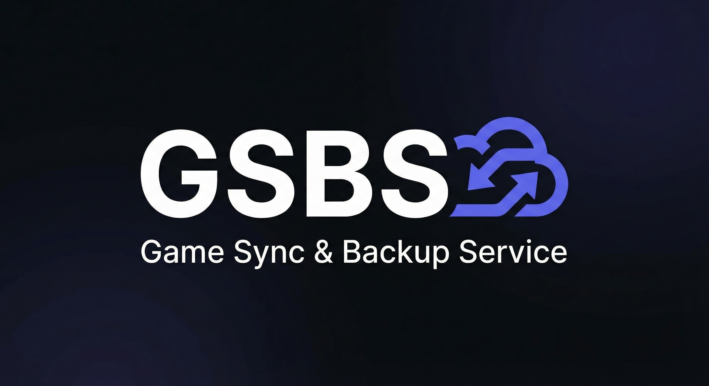

# GSBS — Game Sync & Backup Service

[](https://github.com/dlommm/GSBS--Game-Sync---Backup-Service-/actions/workflows/ci.yml)
[](LICENSE)
[](https://hub.docker.com/r/dendlomm/gsbs-server)
[](https://github.com/dlommm/GSBS--Game-Sync---Backup-Service-/releases/latest)



**Sync game saves across Windows and Linux.** Run a central server, install clients on each PC, and GSBS keeps saves in sync — only writing pulled files where the game is actually installed.

| Dashboard | System tray |
|-----------|-------------|
|  |  |

## Quick install

### 1. Server (Docker Compose — recommended)

```bash
git clone https://github.com/dlommm/GSBS--Game-Sync---Backup-Service-.git
cd GSBS--Game-Sync---Backup-Service-   # folder name matches the GitHub repo name
cp .env.example .env
# Edit .env — set GSBS_SESSION_SECRET (openssl rand -hex 32)
docker compose up -d
```

Open `https://your-domain` (via Caddy) or use [docker-compose.dev.yml](docker-compose.dev.yml) for local HTTP on port 8080. See [docs/COMPOSE.md](docs/COMPOSE.md) and [docs/INSTALL.md](docs/INSTALL.md).

### 2. Client

Download the latest release for your platform from [GitHub Releases](https://github.com/dlommm/GSBS--Game-Sync---Backup-Service-/releases/latest):

| Platform | Install |
|----------|---------|
| **Windows** | Run `gsbs-client-setup-X.Y.Z-windows-amd64.exe` |
| **Linux (Debian/Ubuntu)** | `sudo dpkg -i gsbs-client_X.Y.Z_amd64.deb` |
| **Linux (portable)** | `chmod +x gsbs-client-X.Y.Z-x86_64.AppImage && ./gsbs-client-*.AppImage` |

Sign in via the tray menu (**Login…**), point at your server URL, and syncing starts automatically. Clients check for updates daily from GitHub Releases.

### 3. First sync

Register on the server WebUI, create an API token, and log in from the client. GSBS discovers installed games, watches save folders, and uploads changes. New machines pull existing saves when the target folder exists.

## Features

- **Multi-user** — many users, each with multiple clients (desktop + laptop).
- **Auto-upload** — watches save locations and uploads on change.
- **Auto-discovery** — scans Steam, Epic, GOG, Ubisoft, Heroic, Lutris, and more against the PCGW manifest.
- **Offline queue** — failed uploads persist and retry automatically.
- **Pull on new client** — only writes saves where the game folder exists.
- **OS-aware paths** — `%USERPROFILE%`, Steam libraries, Proton `compatdata`, etc.
- **WebUI + admin** — dashboard, save versions, activity, admin overview.
- **Client auto-update** — checks GitHub Releases; install from the tray menu.

## Documentation

| Guide | Description |
|-------|-------------|
| [docs/INSTALL.md](docs/INSTALL.md) | Install server and client on each platform |
| [docs/COMPOSE.md](docs/COMPOSE.md) | Docker Compose + TLS (Caddy) |
| [docs/DOCKER.md](docs/DOCKER.md) | Docker image, env vars, production tips |
| [docs/CLIENT.md](docs/CLIENT.md) | Client behavior, tray, paths, auto-update |
| [docs/ARCHITECTURE.md](docs/ARCHITECTURE.md) | Data model, sync flow, PCGW, security |
| [docs/API.md](docs/API.md) | REST API reference |
| [docs/EXAMPLE_CONFIG.md](docs/EXAMPLE_CONFIG.md) | Client config JSON examples |
| [docs/TROUBLESHOOTING.md](docs/TROUBLESHOOTING.md) | Common problems and fixes |
| [docs/UPGRADE.md](docs/UPGRADE.md) | Upgrade server and client |
| [docs/RELEASE.md](docs/RELEASE.md) | Maintainer release workflow |
| [CONTRIBUTING.md](CONTRIBUTING.md) | Build from source, tests, conventions |
| [SECURITY.md](SECURITY.md) | Security policy |

## Build from source

Requires **Go 1.25+** and **Node.js** (for WebUI CSS).

```bash
go mod tidy
./script/build-webui.sh
go build -o gsbs-server ./server
go build -o gsbs-client ./client
```

Run tests: `go test ./server/... ./pkg/... ./client/...`

See [CONTRIBUTING.md](CONTRIBUTING.md) for lint, coverage, and conventions.

## Troubleshooting

| Symptom | Where to look |
|---------|---------------|
| WebUI blank or login fails | [docs/TROUBLESHOOTING.md](docs/TROUBLESHOOTING.md) — server section |
| Client 401 / not syncing | Re-login from tray; check `gsbs.log` — [docs/CLIENT.md](docs/CLIENT.md) |
| No tray icon (Linux) | AppIndicator packages — [docs/CLIENT.md](docs/CLIENT.md) |
| Upgrading server or client | [docs/UPGRADE.md](docs/UPGRADE.md) |

## Architecture

```
                    ┌─────────────────────────────────────────┐
                    │              GSBS Server                 │
                    │  Auth · WebUI · Save storage · PCGW job │
                    └─────────────────────────────────────────┘
                                      ▲
              ┌───────────────────────┼───────────────────────┐
              │                       │                       │
        ┌─────┴─────┐           ┌─────┴─────┐           ┌─────┴─────┐
        │  Client   │           │  Client   │           │  Client   │
        │ (Windows) │           │  (Linux)  │           │    …      │
        └───────────┘           └───────────┘           └───────────┘
```

## Repository layout

- `server/` — API, auth, WebUI, PCGW cron job
- `client/` — Windows/Linux tray client (watch, sync, auto-update)
- `pkg/` — shared types, path resolution, PCGW client
- `cmd/` — `pcgw-sync`, `pcgw-fetch`, icon tools
- `script/` — build, release, packaging (Inno Setup, `.deb`, AppImage)
- `docs/` — guides and examples

## License

[MIT](LICENSE)
