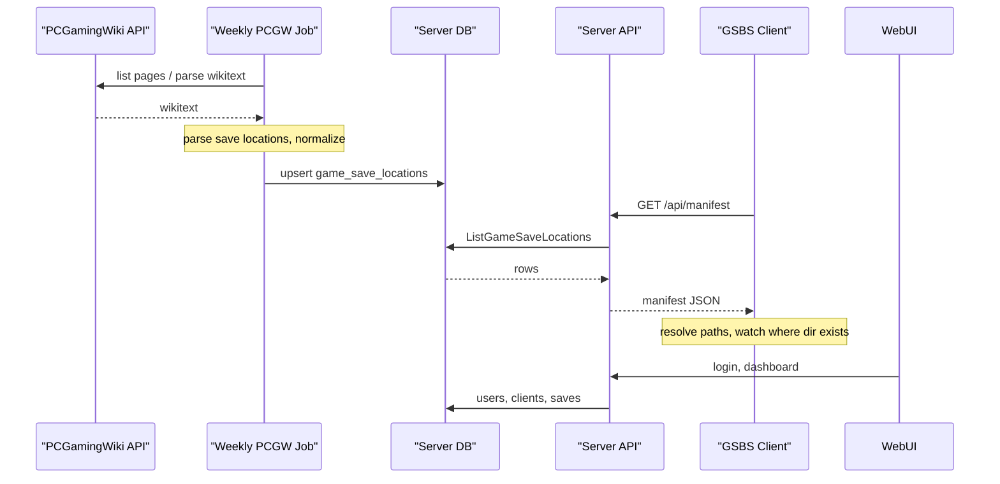

# GSBS Architecture

## Overview

- **Server**: Central service. Handles user auth, stores one copy of each “logical” save per user (keyed by game + path key). Exposes push/pull/list APIs.
- **Clients**: One process per machine (Windows or Linux). Resolve OS-specific paths, watch only existing save directories, upload on change, pull on sync and write only when the target folder exists.

## Data model (server)

- **Users**: `id`, `username`, password hash, created_at.
- **Clients**: `id`, `user_id`, `name`, `os` (windows/linux), last_seen, optional auth token.
- **Job runs**: `id`, `job_name`, `started_at`, `finished_at`, `status` (running/success/failed), `error_message`, `entries_count`. Tracks PCGW sync job executions for the admin dashboard.
- **Manifest fetches**: `id`, `client_id`, `client_name`, `username`, `entries_count`, `fetched_at`. Logs every manifest download for admin visibility.
- **Saves**: `user_id`, `game_id` (e.g. PCGW page or Steam App ID), `path_key` (stable key for the logical path, e.g. hash of normalized path), `content` (binary or path to blob), `updated_at`. One “current” version per (user, game_id, path_key).

Path key ensures the same logical save (e.g. “Assassin’s Creed Rogue – Ubisoft Connect Worldwide”) maps to one blob even if absolute paths differ per OS (e.g. Windows vs Linux).

## Sync flow

1. **Upload (client → server)**  
   Client detects change under a watched path → uploads file with `game_id`, `path_key`, optional metadata. Server overwrites stored save for that user/game_id/path_key.

2. **Download (server → client)**  
   Client requests “all saves for this user”. Server returns list of (game_id, path_key, updated_at, blob). Client for each item:
   - Resolves path for current OS (using PCGW or cached data).
   - If the target directory **does not exist**, skip (game not installed).
   - If it exists, write file (and optionally backup existing).

## Path resolution

- **Placeholders** (from PCGW or config):
  - Windows: `%USERPROFILE%`, `%LOCALAPPDATA%`, `%APPDATA%`, etc.
  - Both: `<SteamLibrary-folder>`, `<Ubisoft-Connect-folder>`, `<user-id>` (from launcher).
- **Resolution**: Client replaces placeholders from environment and known install paths (Steam library paths, Ubisoft Connect path, etc.). Under Linux, Proton paths: `<SteamLibrary-folder>/steamapps/compatdata/<AppID>/pfx/...`.
- **Folder-exists rule**: Before writing a pulled save, client checks directory existence; if missing, skip and optionally log “game not installed”.

## PCGamingWiki integration

- **Game list**: Cargo `Infobox_game` (and redirect API by Steam App ID / GOG ID) to get game page titles/IDs.
- **Save locations**: Stored in “Game data” sections (templates like “Save game data location”, “Configuration file(s) location”). Options:
  - **A**: Parse wikitext via MediaWiki `parse` API and extract paths (and OS/platform tags) into a local cache/DB.
  - **B**: Maintain a local DB of (game_id, os, path_template) and optionally backfill from PCGW or community data.
- **Cache**: Server or client can cache “game → list of path templates per OS” to avoid repeated PCGW requests and to work offline.

## Data flow

- **PCGW to Server**: A weekly job (cron, or `cmd/pcgw-sync`) lists game pages from the Cargo `Infobox_game` table, fetches each page wikitext via the MediaWiki parse API, parses save/config path templates (including `{{Game data/saves|...}}` and section/table fallback), normalizes placeholders to resolver form, and upserts into the server table `game_save_locations`. Rate limit: 1 request/second.
- **Server to Client (manifest)**: Clients call `GET /api/manifest` (optional `?since=<RFC3339>` for delta). The server returns all (or updated) `game_save_locations` entries. Clients cache the result on disk and use it to build the effective watch list: filter by platform (windows/linux), resolve path templates for the current OS, and only watch paths where the directory exists. Config `watch_paths` are merged (user overrides first, then manifest-derived paths).
- **WebUI**: Users open the server in a browser. Login/register use the same auth as the API; a signed session cookie identifies the user. The dashboard shows the user registered clients and synced saves (game_id, path_key, updated_at).

## Database (server)

- **game_save_locations**: `id`, `game_id`, `pcgw_page_id`, `game_title`, `platform`, `path_template`, `is_config`, `updated_at`, `source`. Unique on `(game_id, platform, path_template)`. Filled by the PCGW sync job; read by the manifest API.

## Server-Sent Events (SSE)

- **Hub**: `server/sse/hub.go` manages a set of connected SSE clients. Supports Subscribe (returns event channel + unsubscribe func), Broadcast (non-blocking fan-out), and Count.
- **Endpoint**: `GET /api/events` (auth required). Clients connect with their Bearer token and receive a long-lived SSE stream. Events are typed (e.g. `manifest-updated`).
- **Push manifest**: Admin can push a `manifest-updated` event to all connected clients via `POST /admin/push-manifest` in the WebUI. This also invalidates the server's manifest cache.
- **Client listener**: `ListenSSE()` in `client/manifest.go` connects to SSE, auto-reconnects with exponential backoff (2s-60s). On `manifest-updated`, the sync loop re-fetches the manifest, updates watch paths, and triggers a pull.

## Job Runner

- **Runner**: `server/job/runner.go` wraps job execution with DB tracking (`job_runs` table), dedup (prevents concurrent runs of the same job), and SSE broadcast on completion.
- **PCGW sync**: Runs weekly (Sunday 03:00 via cron) or manually via `POST /admin/run-job` in the admin WebUI. Logs start/finish/status/error/entries_count.

## Admin WebUI

- **Stats**: User count, client count, save count, storage, manifest entries, SSE clients.
- **Jobs panel**: Shows recent job runs (status, duration, entries, errors) with a "Run Now" button.
- **Manifest viewer**: Searchable table of all `game_save_locations` entries with a "Push to Clients" button.
- **Manifest fetch log**: Recent downloads with client name, username, entry count, timestamp.
- **Users and Clients**: Tables with stats and revoke action.

## Operational behaviour

- **Health**: `GET /api/health` returns `{"status":"ok"}` (no auth) for load balancers and probes.
- **Push body limit**: POST `/api/saves` body is limited to 50 MiB to avoid resource exhaustion.
- **Graceful shutdown**: Server handles SIGINT/SIGTERM, stops accepting new requests, and shuts down within 15 seconds.
- **SQLite**: WAL mode and a single open connection are used for stability and to avoid “database is locked” under concurrent use.

## Security

- All API access authenticated (e.g. per-user API token or session).
- Clients only access their own user’s saves.
- WebUI uses a signed session cookie (set `GSBS_SESSION_SECRET` in production).
- Optional TLS for server and client–server communication.
