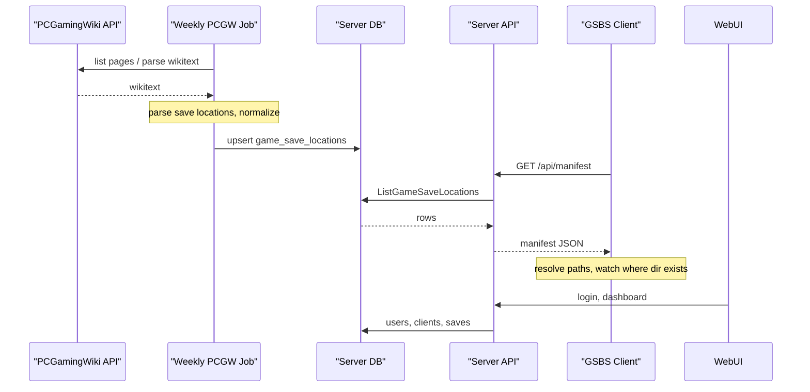

# GSBS Architecture


## Overview

- **Server**: Central service. Handles user auth, stores one copy of each “logical” save per user (keyed by game + path key). Exposes push/pull/list APIs.
- **Clients**: One process per machine (Windows or Linux). Resolve OS-specific paths, watch only existing save directories, upload on change, pull on sync and write only when the target folder exists.

## Data model (server)

- **Users**: `id`, `username`, password hash, created_at.
- **Clients**: `id`, `user_id`, `name`, `os` (windows/linux), last_seen, optional auth token.
- **Job runs**: `id`, `job_name`, `started_at`, `finished_at`, `status` (running/success/failed), `error_message`, `entries_count`. Tracks PCGW sync job executions for the admin dashboard.
- **Manifest fetches**: `id`, `client_id`, `client_name`, `username`, `entries_count`, `fetched_at`. Logs every manifest download for admin visibility.
- **Saves**: `user_id`, `game_id`, `path_key`, `updated_at`, optional `relative_path`, optional `storage_path`, optional inline `content` BLOB (legacy). One current version per (user, game_id, path_key). When `GSBS_SAVE_ROOT` is set, file bytes live on disk under `{GSBS_SAVE_ROOT}/{user_id}/{game_id}/…`; SQLite holds metadata only.
- **Manifest save rules**: PCGW paths are normalized into `SaveRule` records (`directory`, `include_patterns`, `recursive`, `sync_all`) stored in `game_save_locations.save_rules_json` and exposed on manifest v2 as `save_rules`. Clients watch **directories only** and filter uploads by `include_patterns`.

**Path key scheme (2.0):**
- **PCGW-sourced rules** — `path_key` is derived from `(game_id, slot_label, is_config)`. `slot_label` is an OS-neutral integer index assigned during PCGW ingest (e.g. `"0"`, `"1"`). Because the key does not include any OS-specific path content, the same logical save slot produces the **same `path_key` on Windows and Linux**, enabling cross-OS sync.
- **User-defined rules** (`watch_paths` in config) — `path_key` is a hash of the full rule definition and is therefore OS-specific. Two machines running different OSes will not share the same `path_key` for a manually configured path. This is intentional: user-defined paths are inherently per-machine.
- **Per-file slots** — for rules that produce multiple files, `path_key` = hash(rule_key + relative_path). Legacy single-file slots keep one blob per rule_key.

## Sync flow

1. **Upload (client → server)**  
   Client watches resolved save **directories** (not globs). On change, files matching `include_patterns` are debounced and pushed with `game_id`, `path_key`, `X-Relative-Path` (path within the rule directory), and optional `X-Content-Hash`. Server writes under `{GSBS_SAVE_ROOT}/{user_id}/…` when configured, else inline BLOB.

2. **Download (server → client)**  
   Client requests “all saves for this user”. Server returns list of (game_id, path_key, updated_at, blob). Client for each item:
   - Resolves path for current OS (using PCGW or cached data).
   - If the target directory **does not exist**, skip (game not installed).
   - If it exists, write file (and optionally backup existing).

## Multi-client conflict resolution (4.0.0)

Two machines can change the same save between syncs. GSBS resolves this without a central lock, using content hashes and per-slot preconditions rather than trusting clocks.

**On push**, the client sends a precondition so the server never silently clobbers:
- `X-GSBS-If-Hash: <last-known>` when it has synced this slot before → server returns **409** if its current hash differs (optimistic concurrency).
- `X-GSBS-If-Absent: 1` on the *first* push of a slot (fresh device or cleared cache) → server returns **409** if a *different* save already exists. This guard is always on as of 4.0.0, so a new machine can no longer overwrite another's save on first contact.

A 409 is recorded as a conflict on the client (tray + `conflicts.json`) and resolved by the user, not auto-picked.

**On pull**, `DecidePull` compares the local file mtime against the server's `updated_at`. Because those come from *different clocks*, the client first estimates the server offset from response `Date` headers and treats timestamps within a ±2-minute window as simultaneous. The decision matrix (content differs):

| Policy | local newer (outside window) | server newer (outside window) | within skew window |
|---|---|---|---|
| `last_write_wins` (default) | skip (keep local) | apply (take server) | **conflict** |
| `keep_local` | skip | apply | skip |
| `keep_server` | apply | apply | apply |

Per-game overrides (`conflict_policy_overrides`) select the policy per game. Reconciliation on startup refuses to run at all if it can't fetch the server's hashes (never pushes blind).

## Encryption model

End-to-end encryption is **client-side and optional** (per account flag + local passphrase). The server only ever stores ciphertext and cannot read encrypted saves.

- **Envelope**: AES-256-GCM. Two KDF formats coexist — legacy `v1` (PBKDF2-SHA256, 100k) with no prefix, and `v2` (`gsbs2:` prefix, Argon2id t=3/64 MiB). Clients read both formats forever.
- **Fleet auto-negotiation**: a client writes the stronger `v2` format only once the server reports every device seen in the last 30 days runs ≥ 4.0.0 (`crypto_v2_ready`), so a mixed fleet never produces a blob an older device can't read. `crypto_v2: true/false` in the client config forces or pins the format.
- **Stale-device caveat**: the 30-day window means a legacy-only device that stops syncing is eventually dropped from the readiness check; if it comes back after the fleet switched to `gsbs2:`, it cannot decrypt newly encrypted saves until updated (the server still holds the ciphertext — nothing is lost). Settings → Encryption Center names such devices.
- **Hashes**: the client dedups and sends `X-Content-Hash` as the *plaintext* SHA-256. For unencrypted pushes the server verifies it against the received bytes; for encrypted pushes it can't (only ciphertext is transmitted) and stores the declared value by design.
- **At rest on the server**: TOTP secrets are sealed with AES-256-GCM under a key file in `gsbs-keys/` (kept outside the database). Back up `gsbs-keys/` with the DB.

## Threat model

| Threat | Mitigation |
|---|---|
| Network attacker (MITM) | Deploy behind TLS (Caddy/nginx/Traefik); the server sets HSTS and marks cookies Secure when it sees HTTPS. Encrypted saves are authenticated end-to-end (AES-GCM). |
| Stolen device token | Tokens are stored SHA-256-hashed with a 90-day expiry; revoke per-device from the Devices page; a password change revokes all other devices + sessions. |
| Malicious / buggy client | Server validates every path (`pkg/savepath`), caps sizes, enforces quota in-transaction, and verifies the content hash for unencrypted pushes. |
| Database file / backup exfiltration | Passwords are bcrypt; TOTP secrets are encrypted under `gsbs-keys/` (not in the DB). Save *content* is only protected if the user enabled E2E encryption. |
| Quota abuse / storage exhaustion | Per-user and global limits count version history and are enforced inside the write transaction; a disk-free preflight returns 507 before writing. |
| Cross-user access | Every save/version query is scoped by `user_id`; admin vs user is role-gated. |
| Brute force | Per-IP rate limiting on password login, TOTP verify, and registration; single-use TOTP codes. |
| SSRF via cover proxy | The cover fetcher only contacts the fixed Steam CDN and an allowlist of PCGW image hosts, with numeric IDs and size/type caps. |

Residual (documented) gaps: unsigned installers/binaries (needs paid signing), and save content is unprotected unless the user opts into E2E encryption.

## Path resolution

- **Placeholders** (from PCGW or config):
  - Windows: `%USERPROFILE%`, `%LOCALAPPDATA%`, `%APPDATA%`, etc.
  - Both: `<SteamLibrary-folder>`, `<Ubisoft-Connect-folder>`, `<GOG-Galaxy-folder>`, `<Epic-Games-folder>`, `<Xbox-App-folder>`, `<user-id>` (from launcher).
- **Resolution**: Client replaces placeholders from environment and known install paths (Steam library paths, Ubisoft Connect path, etc.). Under Linux, Proton paths: `<SteamLibrary-folder>/steamapps/compatdata/<AppID>/pfx/...` — the client synthesizes these `compatdata` paths for Windows games running under Steam/Proton.
- **Folder-exists rule**: Before writing a pulled save, client checks directory existence; if missing, skip and optionally log “game not installed”.

## Cross-OS sync (Windows ↔ Linux)

For PCGW-tracked games, the same logical save location maps to the same `slot_label` on the server, and therefore the same `path_key`, regardless of OS. The sync flow is:

1. **Windows client** watches `%APPDATA%\<Game>\saves\` → pushes with `path_key` derived from `(game_id, "0", false)`.
2. **Linux client** watches `~/.local/share/<Game>/saves/` (or a Proton `compatdata` path) → pushes with the **same** `path_key` because both rules share `slot_label = "0"`.
3. Server stores one record under `(user, game_id, path_key)`.
4. Both machines pull each other's saves and write to their respective OS-native paths.

**User-defined rules** (`watch_paths` in `config.json`) are OS-specific by design: they hash the full rule and do not share a `slot_label`. Two machines with manually configured paths will not cross-sync with each other unless they use the same rule definition.

## PCGamingWiki integration

- **Game list**: Cargo `Infobox_game` (and redirect API by Steam App ID / GOG ID) to get game page titles/IDs.
- **Save locations**: Stored in “Game data” sections (templates like “Save game data location”, “Configuration file(s) location”). Options:
  - **A**: Parse wikitext via MediaWiki `parse` API and extract paths (and OS/platform tags) into a local cache/DB.
  - **B**: Maintain a local DB of (game_id, os, path_template) and optionally backfill from PCGW or community data.
- **Cache**: Server or client can cache “game → list of path templates per OS” to avoid repeated PCGW requests and to work offline.

## Data flow

- **PCGW to Server**: A weekly job (cron, or `cmd/pcgw-sync`) lists game pages from Cargo `Infobox_game`, fetches wikitext (2s rate limit by default), ingests **all sections** into `pcgw_*` tables, and **projects** save/config paths into `game_save_locations`. Incremental sync skips unchanged pages via `last_rev_id` + `content_hash`. Manual sync: admin WebUI `/admin/pcgw` or `POST /admin/run-job`.
- **Server to Client (manifest)**: Clients call `GET /api/manifest/v2` (preferred) or `GET /api/manifest` v1. v2 returns rich per-game metadata for discovery; v1 remains flat path rows for compatibility.
- **WebUI**: Users open the server in a browser. Login/register use the same auth as the API; a signed session cookie identifies the user. The dashboard shows the user registered clients and synced saves (game_id, path_key, updated_at).



## Database (server)

- **game_save_locations**: v1 manifest projection (path rows). Unique on `(game_id, platform, path_template)`.
- **pcgw_games**, **pcgw_game_data**, **pcgw_** section tables, **pcgw_metadata** (optional zstd full wikitext), **pcgw_sync_runs**, **pcgw_manifest_meta**: full PCGW mirror. Admin WebUI: `/admin/pcgw`.

## Server-Sent Events (SSE)

- **Hub**: `server/sse/hub.go` manages a set of connected SSE clients. Supports Subscribe (returns event channel + unsubscribe func), Broadcast (non-blocking fan-out), and Count.
- **Endpoint**: `GET /api/events` (auth required). Clients connect with their Bearer token and receive a long-lived SSE stream. Events are typed (e.g. `manifest-updated`).
- **Push manifest**: Admin can push a `manifest-updated` event to all connected clients via `POST /admin/push-manifest` in the WebUI. This also invalidates the server's manifest cache.
- **Client listener**: `ListenSSE()` in `client/manifest.go` connects to SSE, auto-reconnects with shared exponential backoff (`pkg/retry`, 2s–60s cap). On `manifest-updated`, the sync loop re-fetches the manifest, updates watch paths, and triggers a pull.

## Watcher and retry

- **Save rules** (`pkg/saverule`): PCGW pipe/glob strings parse into directory + `include_patterns`. Example: `gamesaves/*.png|gamesaves/*.sav` → watch `gamesaves/`, upload only `*.png` and `*.sav`.
- **Watcher supervisor**: `RunWatcherSupervisor` in `client/sync/` restarts fsnotify on channel close, filters events by manifest patterns, removes stale paths on manifest refresh/discovery, and exposes health via `WatcherHealthy`.
- **Network retry**: Shared `pkg/retry` backoff for pull, push, manifest fetch, SSE, and outbox (outbox uses longer delays and drops entries after 7 days). Push skips unchanged content via client hash cache and server `unchanged` response.
- **Change-detection hash**: dedup, `X-Content-Hash`, optimistic concurrency, watcher echo-suppression, and reconcile all key off the **plaintext** content hash (`ContentChangeHash`), not the encrypted wire bytes. AES-GCM is non-deterministic (fresh salt+nonce per call), so hashing ciphertext would make encrypted saves appear changed every cycle. The encrypted wire bytes are still what's transmitted/stored; `X-Content-Size` reports the wire (stored) length.
- **Optimistic concurrency**: steady-state pushes send `X-GSBS-If-Hash` (last known content hash); the server returns 409 if its hash differs (no wall-clock involved). When a client has no known hash for a slot it sends `X-GSBS-If-Absent: 1` so the server rejects (409) rather than silently overwriting a *different* existing save. The first-push guard is enabled for `keep_local`/`keep_server`; `last_write_wins` keeps blind overwrite by design.
- **Bounded pulls**: clients sync summaries-first (`/api/saves?summaries=1`) and fetch only changed blobs; the full-pull fallback paginates so neither side buffers an entire library.

## Job Runner

- **Runner**: `server/job/runner.go` wraps job execution with DB tracking (`job_runs` and `pcgw_sync_runs` tables), in-memory + DB dedup (prevents concurrent runs), cancel/resume support, and SSE broadcast on completion.
- **Job statuses** (`server/job/status.go`): `running`, `success`, `failed`, `canceled`, `interrupted`. On server startup, stale `running` rows in `job_runs` and `pcgw_sync_runs` are reconciled to `interrupted` with a restart message.
- **PCGW sync resume**: Incremental syncs can resume from the latest `pcgw_sync_runs` row with status `interrupted`, `failed`, or `canceled` and `checkpoint_offset > 0`. Full syncs (`ForceFull`) bypass resume. Resumed runs link via `resumed_from_run_id` and `notes`.
- **PCGW sync schedule**: Weekly Monday 03:00 via cron (`GSBS_PCGW_CRON`, default `0 3 * * 1`) when sync source is **API** (`pcgw_sync_source=api`). Set `GSBS_PCGW_CRON=""` to disable scheduled sync; unset env uses the default. When env is not set, cron is configurable in admin **Settings** (`admin_settings.pcgw_cron`) with live reschedule. Manual trigger via admin WebUI (`POST /admin/run-job` / PCGW admin actions).
- **Manifest bundle sync (GitHub mode)**: Default for fresh installs (`pcgw_sync_source=github`). Job `pcgw_bundle_fetch` (`server/job/pcgw_bundle_fetch.go`) HTTP GETs the official bundle from [gsbs-manifest](https://github.com/dlommm/gsbs-manifest) with `If-None-Match` (304 = no work). Seeded servers prefer delta bundles; empty DB uses full bundle on first start. Import uses `merge_skip_unchanged` or `delta` smart merge; manifest version bumps only when rows change. Cron: `pcgw_bundle_cron` (default weekly Monday 03:00), overridable via `GSBS_PCGW_BUNDLE_CRON`. See [MANIFEST_BUNDLE.md](MANIFEST_BUNDLE.md).
- **PCGW filters**: Title and path substring excludes in `admin_settings` (`pcgw_title_excludes`, `pcgw_path_excludes` JSON arrays). Applied during sync in `server/job/pcgw_persist.go`; default path excludes filter common noise (`home`, `.exe`, `.dll`, `steamapps`, `common`).
- **PCGW export/import**: Admin can download `GET /admin/pcgw/export/manifest.json.gz` (gzip bundle with manifest + PCGW mirror tables) and upload via `POST /admin/pcgw/import` (`merge` or `full_replace`). Post-import validation counts rows and samples game_data.
- **First-start auto sync**: Optional `pcgw_auto_run_on_first_start` in admin settings; runs incremental sync once when `pcgw_first_run_done` is unset.

## WebUI (server and client)

Both UIs share a single compiled design system. Run `./script/build-webui.sh` (requires Node/npx) before building — this compiles Tailwind CSS from `server/webui/static/src/input.css` and syncs the output (`app.css`, fonts, favicon) to both `server/webui/static/` and `client/webui/static/`. Fonts (DM Sans, JetBrains Mono) are vendored as woff2 files — no CDN dependency, works offline and in Docker.

### Shared design system

- **Source**: `server/webui/static/src/input.css` — CSS variables (dark theme tokens), 60+ semantic component classes (`.panel`, `.stat-card`, `.btn-primary`, `.topbar`, `.badge-*`, etc.), and `@font-face` rules for vendored fonts.
- **Build**: `script/build-webui.sh` compiles via `tailwindcss@3` scanning both `server/webui/templates/**` and `client/webui/templates/**`, then syncs assets to the client.
- **Toast system**: `server/webui/static/toast.js` (also synced to `client/webui/static/`) provides `gsbs.toast(msg, type)` for success/error/info/warn notifications. Wired to SSE `audit-updated` events on the server; wired to client polling callbacks.

### Server WebUI

`server/webui/`: Tailwind-compiled `static/app.css`, embedded HTMX 2.0.4 + SSE extension, shared `templates/layout.html`, and HTMX partials for live updates.

- **Dashboard** (`GET /dashboard`): Stats quota bar, clients (with user revoke via `POST /dashboard/clients/revoke`), searchable saves, activity timeline. SSE on `GET /dashboard/events`; partials refresh on `save-updated`. `audit-updated` SSE events surface as toast notifications.
- **Admin routes** (session + admin role / `GSBS_ADMIN_USERNAME`):
  - `GET /admin` — overview with SVG charts from `stats_snapshots`, global stats, server config
  - `GET /admin/users` — users table with client-count bars, all clients with revoke
  - `GET /admin/manifest` — server-side search (`q`), pagination; `GET /admin/partial/manifest` HTMX partial
  - `GET /admin/activity` — jobs (`GET /admin/partial/jobs`), manifest fetches, audit log, stats snapshots
  - `GET /admin/settings` — PCGW sync source (GitHub bundle / API), bundle cron/URLs, API cron, filters, first-start auto sync (`POST /admin/settings/save`)
  - `GET /admin/analytics` — storage, active clients, sync volume, PCGW coverage %, SVG trend charts
  - `GET /admin/pcgw` — PCGW sync status with 6 summary stat cards, control actions, job progress
- **Admin POST**: `POST /admin/revoke`, `/admin/push-manifest`, `/admin/run-job`, user disable/enable/delete/quota (unchanged paths).
- **Handler layout**: `server/webui/router.go`, `handlers_*.go`, `render.go` (template funcs: `chartLineSVG`, `auditLabel`).

### Client WebUI

`client/webui/`: Embedded Go templates + the same compiled `app.css` (synced from server). Served locally on `127.0.0.1:41234–41239`. No CDN dependency — fonts, CSS, and JS are all embedded in the binary.

- **Package**: `github.com/gsbs/gsbs/client/webui` — `embed.go` (embeds templates + static), `render.go` (`PageData`, `ParseTemplates()`, `RenderPage()`).
- **Pages**: Setup/login (`/`), Dashboard (`/dashboard`), Add game (`/games`), Quick actions (`/quick-actions`), Help (`/help`), About (`/about`), Open log (`/open-log`).
- **JSON endpoints** (not pages): `/status`, `/games/search`, `/api/sync-now`.
- **Navigation**: All 6 pages share the same `.topbar` + `.topbar-nav` structure as the server UI; About is included in the nav (previously orphaned).
- **Live updates**: Dashboard polls `/status` every 5 seconds; status dots use `var(--success)` / `var(--error)` CSS variables; toast notifications replace `alert()` calls.
- **Setup handler** (`client/setup_server.go`): Port binding, tray wiring, and JSON logic unchanged; HTML rendering delegates to `client/webui` templates.

## Operational behaviour

- **Health**: `GET /api/health` returns `{"status":"ok"}` (no auth) for load balancers and probes. For readiness (e.g. Kubernetes), use `GET /api/health?ready=1`: it runs a quick DB check; on success returns 200 `{"status":"ok","db":"ok"}`, on failure returns 503 `{"status":"unhealthy","db":"error"}` so you can distinguish “live” vs “ready”.
- **Push body limit**: POST `/api/saves` body is limited to 50 MiB to avoid resource exhaustion.
- **Graceful shutdown**: Server handles SIGINT/SIGTERM, stops accepting new requests, and shuts down within 15 seconds.
- **SQLite**: WAL mode and a single open connection are used for stability and to avoid “database is locked” under concurrent use.
- **Crash-safe save writes**: with `GSBS_SAVE_ROOT` set, the canonical save file is written via temp-file + `fsync` + atomic `rename` + parent-directory `fsync`. After a crash or power loss the destination is either the previous bytes or the complete new bytes — never a torn/partial save.

## Security

- **Rate limiting**: Defaults apply when env is unset (override with `GSBS_RATE_LIMIT_*`): auth 20/min per IP, push 120/min per user, pull 60/min, manifest 60/min, general API 300/min. Returns 429 when exceeded; denials are logged via structured logging.
- **Token storage**: Client API tokens are stored as SHA-256 hashes in SQLite. Tokens expire after `GSBS_TOKEN_MAX_AGE` (default 90 days). Use `Authorization: Bearer` only (query-string tokens are rejected).
- **Optional E2E encryption**: Users enable encryption in WebUI settings (`users.encryption_enabled`). Clients encrypt saves locally with `encryption_passphrase` in config (never sent to server). Server stores ciphertext; per-save `encrypted` flag supports mixed plaintext during migration (existing saves stay plaintext until re-uploaded).
- **Structured logging**: Server uses zerolog (`GSBS_LOG_LEVEL`); client uses slog with the same env var. Request IDs are returned in `X-Request-ID`.
- All API access authenticated (e.g. per-user API token or session).
- Clients only access their own user’s saves.
- WebUI uses a signed session cookie (set `GSBS_SESSION_SECRET` in production). Session and CSRF cookies use the `Secure` flag when the request is over TLS or `X-Forwarded-Proto: https`.
- WebUI state-changing forms (login, register, logout, admin actions) are protected with CSRF: a signed token is set on GET and validated on POST.
- Optional TLS for server and client–server communication.

## 2.0 schema migration

GSBS 2.0 introduces a one-way DB migration that:
- Adds `slot_label` to `save_rules_json` for all existing PCGW-sourced `game_save_locations` rows.
- Backfills `path_key` for any `saves` rows that can be re-keyed to the new OS-neutral scheme.

**The migration is one-way and cannot be automatically rolled back.** Recommended procedure:

1. **Back up your data volume** before upgrading (see `docs/DOCKER.md` for WAL-safe backup instructions).
2. **Preview** the migration without writing any changes:
   ```bash
   GSBS_DRY_RUN_MIGRATION=1 docker run --rm -v gsbs-data:/app/data -e GSBS_DB=/app/data/gsbs.db dendlomm/gsbs-server:2.0.0
   ```
   Check the logs for row counts and any warnings.
3. **Upgrade for real** by restarting the container without `GSBS_DRY_RUN_MIGRATION`. The migration runs automatically on startup.
4. After the migration, existing clients will re-sync saves for PCGW-tracked games using the new `path_key` scheme (a one-time re-sync check — no data loss).

## PCGW Sync Troubleshooting

### Choosing a sync action

| Action | When to use |
|---|---|
| **Incremental Sync** | Routine use. Performs a single-call catalog probe to detect new game IDs, then processes missing, changed, and previously failed games. Only runs a full catalog scan on first run, when the catalog is incomplete, or when a periodic interval triggers (`GSBS_PCGW_FULL_CATALOG_DAYS`). ETA shown live in the admin WebUI. |
| **Refresh New Games** | When you want to force a full catalog rescan and pick up newly added games. Always runs Phase 1 in full (bypasses the fast probe). Processes missing entries afterward. |
| **Auto Catch-Up** | After a long outage or first-time setup. Repeats budgeted incremental sync cycles until missing/failed/title-backfill backlog is empty (up to 25 cycles). Stops early if no progress is made in two consecutive cycles. Does not process dead-letter pages — reset dead-letter first if that count is non-zero. |
| **Parse Missing Only** | Skips Phase 1; ingests only catalog IDs not yet stored locally (`pcgw_catalog` minus `pcgw_games`, excluding dead-letter). Does not retry failed pages or run rev-check. |
| **Retry Failed Pages** | Skips Phase 1; re-processes only `failed`/`partial` rows (excluding dead-letter). |
| **Reset Dead Letter** | Clears `dead_letter=1` on blocked catalog rows so they re-enter Phase 2 queues. Run Auto Catch-Up or Incremental Sync afterward. |
| **Rebuild Save Locations** | Bumps manifest version/etag so clients re-fetch `/api/manifest` without downloading PCGW pages. Does not re-project `game_save_locations` from stored mirror data. |
| **Refresh Catalog Only** | Phase 1 only — updates `pcgw_catalog` without fetching page content. |
| **Full Reparse** | Forces a full catalog rescan, then re-processes missing, failed, title-backfill, and wiki-changed pages. Unchanged OK pages are skipped. Bypasses resume checkpoints. |
| **Full Catalog Rescan** | Triggered periodically via `GSBS_PCGW_FULL_CATALOG_DAYS` (default 7) or `GSBS_PCGW_FULL_CRON`. Runs a complete enumeration of all PCGW page IDs to detect deletions or ordering changes. Not required for routine incremental syncs. |

### Understanding the status card

- **Remote / Local / Missing**: Remote = total page IDs in the PCGamingWiki catalog. Local = pages successfully stored in GSBS. Missing = pages in the catalog that have never been processed. A non-zero Missing count means data is incomplete; run Incremental Sync to process it.
- **Dead-letter**: Pages that have failed repeatedly and been permanently excluded from normal sync. They still appear in the catalog but won't be retried until you use **Reset Dead Letter**, then **Retry Failed Pages** or **Auto Catch-Up**. Click the count to see which games are affected.
- **Last queue size**: How many pages were queued for processing in the most recent run. A queue of 0 with a non-zero Missing count indicates the no-op gate fired (possible stale state — run Incremental Sync to force a check).
- **Resumable run**: A prior run that was interrupted mid-ingest. The next Incremental Sync will automatically resume from where it left off.
- **Manifest budget**: Maximum number of pages parsed per run, controlled by `GSBS_PCGW_MAX_PAGES_PER_RUN` (default 5000). If the budget is exhausted before the backlog is cleared, run Incremental Sync again or use Auto Catch-Up.

### No-op skip reliability

The incremental sync includes an optimization that skips Phase 2 (page ingest) when the catalog hash is unchanged and there is no known backlog. Phase 2 is only skipped when `missingCount == 0 AND failedCount == 0 AND titleBackfillCount == 0`. If you suspect the no-op is incorrectly firing, run a Full Reparse or inspect the Missing count in the status card.

When the fast catalog probe finds no new IDs and the rev-check interval has not elapsed (default 7 days), `buildChangedQueue` is also skipped, making routine incremental runs exit in seconds. The `catalog_scan_mode` field on each sync run records how Phase 1 ran (`full`, `fast_probe`, `tail`, `skipped`, or `resumed`) — visible in the analytics page under "Latest sync run details".

### Dead-letters and permanent failures

A page becomes a dead-letter when its retry count exceeds the configured threshold. Dead-letter pages are excluded from Incremental Sync to avoid repeated failures. To clear them:
1. Investigate the parse failure via the game detail page (`/admin/pcgw/<pageID>`).
2. Use "Retry Failed Pages" from Advanced Maintenance to force a retry attempt.
3. If the page consistently fails, it may have non-standard wikitext that the parser does not support.
