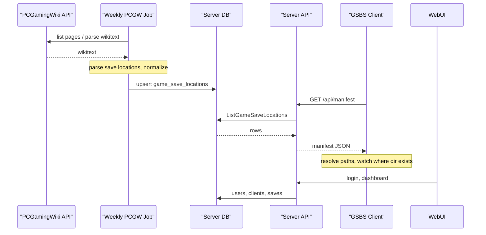

# GSBS Architecture

## Overview

- **Server**: Central service. Handles user auth, stores one copy of each “logical” save per user (keyed by game + path key). Exposes push/pull/list APIs.
- **Clients**: One process per machine (Windows or Linux). Resolve OS-specific paths, watch only existing save directories, upload on change, pull on sync and write only when the target folder exists.

## Data model (server)

- **Users**: `id`, `username`, password hash, created_at.
- **Clients**: `id`, `user_id`, `name`, `os` (windows/linux), last_seen, optional auth token.
- **Job runs**: `id`, `job_name`, `started_at`, `finished_at`, `status` (running/success/failed), `error_message`, `entries_count`. Tracks PCGW sync job executions for the admin dashboard.
- **Manifest fetches**: `id`, `client_id`, `client_name`, `username`, `entries_count`, `fetched_at`. Logs every manifest download for admin visibility.
- **Saves**: `user_id`, `game_id`, `path_key`, `updated_at`, optional `relative_path`, optional `storage_path`, optional inline `content` BLOB (legacy). One current version per (user, game_id, path_key). When `GSBS_SAVE_ROOT` is set, file bytes live on disk under `{GSBS_SAVE_ROOT}/{user_id}/{game_id}/…`; SQLite holds metadata only.
- **Manifest save rules**: PCGW paths are normalized into `SaveRule` records (`directory`, `include_patterns`, `recursive`, `sync_all`) stored in `game_save_locations.save_rules_json` and exposed on manifest v2 as `save_rules`. Clients watch **directories only** and filter uploads by `include_patterns`.

Path keys: `rule_key` = hash(game + rule); per-file slots use `path_key` = hash(rule_key + relative path). Legacy single-file slots keep one blob per rule_key.

## Sync flow

1. **Upload (client → server)**  
   Client watches resolved save **directories** (not globs). On change, files matching `include_patterns` are debounced and pushed with `game_id`, `path_key`, `X-Relative-Path` (path within the rule directory), and optional `X-Content-Hash`. Server writes under `{GSBS_SAVE_ROOT}/{user_id}/…` when configured, else inline BLOB.

2. **Download (server → client)**  
   Client requests “all saves for this user”. Server returns list of (game_id, path_key, updated_at, blob). Client for each item:
   - Resolves path for current OS (using PCGW or cached data).
   - If the target directory **does not exist**, skip (game not installed).
   - If it exists, write file (and optionally backup existing).

## Path resolution

- **Placeholders** (from PCGW or config):
  - Windows: `%USERPROFILE%`, `%LOCALAPPDATA%`, `%APPDATA%`, etc.
  - Both: `<SteamLibrary-folder>`, `<Ubisoft-Connect-folder>`, `<GOG-Galaxy-folder>`, `<Epic-Games-folder>`, `<Xbox-App-folder>`, `<user-id>` (from launcher).
- **Resolution**: Client replaces placeholders from environment and known install paths (Steam library paths, Ubisoft Connect path, etc.). Under Linux, Proton paths: `<SteamLibrary-folder>/steamapps/compatdata/<AppID>/pfx/...`.
- **Folder-exists rule**: Before writing a pulled save, client checks directory existence; if missing, skip and optionally log “game not installed”.

## PCGamingWiki integration

- **Game list**: Cargo `Infobox_game` (and redirect API by Steam App ID / GOG ID) to get game page titles/IDs.
- **Save locations**: Stored in “Game data” sections (templates like “Save game data location”, “Configuration file(s) location”). Options:
  - **A**: Parse wikitext via MediaWiki `parse` API and extract paths (and OS/platform tags) into a local cache/DB.
  - **B**: Maintain a local DB of (game_id, os, path_template) and optionally backfill from PCGW or community data.
- **Cache**: Server or client can cache “game → list of path templates per OS” to avoid repeated PCGW requests and to work offline.

## Data flow

- **PCGW to Server**: A weekly job (cron, or `cmd/pcgw-sync`) lists game pages from Cargo `Infobox_game`, fetches wikitext (2s rate limit by default), ingests **all sections** into `pcgw_*` tables, and **projects** save/config paths into `game_save_locations`. Incremental sync skips unchanged pages via `last_rev_id` + `content_hash`. Manual sync: admin WebUI `/admin/pcgw` or `POST /admin/run-job`.
- **Server to Client (manifest)**: Clients call `GET /api/manifest/v2` (preferred) or `GET /api/manifest` v1. v2 returns rich per-game metadata for discovery; v1 remains flat path rows for compatibility.
- **WebUI**: Users open the server in a browser. Login/register use the same auth as the API; a signed session cookie identifies the user. The dashboard shows the user registered clients and synced saves (game_id, path_key, updated_at).

## Database (server)

- **game_save_locations**: v1 manifest projection (path rows). Unique on `(game_id, platform, path_template)`.
- **pcgw_games**, **pcgw_game_data**, **pcgw_** section tables, **pcgw_metadata** (optional zstd full wikitext), **pcgw_sync_runs**, **pcgw_manifest_meta**: full PCGW mirror. Admin WebUI: `/admin/pcgw`.

## Server-Sent Events (SSE)

- **Hub**: `server/sse/hub.go` manages a set of connected SSE clients. Supports Subscribe (returns event channel + unsubscribe func), Broadcast (non-blocking fan-out), and Count.
- **Endpoint**: `GET /api/events` (auth required). Clients connect with their Bearer token and receive a long-lived SSE stream. Events are typed (e.g. `manifest-updated`).
- **Push manifest**: Admin can push a `manifest-updated` event to all connected clients via `POST /admin/push-manifest` in the WebUI. This also invalidates the server's manifest cache.
- **Client listener**: `ListenSSE()` in `client/manifest.go` connects to SSE, auto-reconnects with shared exponential backoff (`pkg/retry`, 2s–60s cap). On `manifest-updated`, the sync loop re-fetches the manifest, updates watch paths, and triggers a pull.

## Watcher and retry

- **Save rules** (`pkg/saverule`): PCGW pipe/glob strings parse into directory + `include_patterns`. Example: `gamesaves/*.png|gamesaves/*.sav` → watch `gamesaves/`, upload only `*.png` and `*.sav`.
- **Watcher supervisor**: `RunWatcherSupervisor` in `client/sync/` restarts fsnotify on channel close, filters events by manifest patterns, removes stale paths on manifest refresh/discovery, and exposes health via `WatcherHealthy`.
- **Network retry**: Shared `pkg/retry` backoff for pull, push, manifest fetch, SSE, and outbox (outbox uses longer delays and drops entries after 7 days). Push skips unchanged content via client hash cache and server `unchanged` response.

## Job Runner

- **Runner**: `server/job/runner.go` wraps job execution with DB tracking (`job_runs` and `pcgw_sync_runs` tables), in-memory + DB dedup (prevents concurrent runs), cancel/resume support, and SSE broadcast on completion.
- **Job statuses** (`server/job/status.go`): `running`, `success`, `failed`, `canceled`, `interrupted`. On server startup, stale `running` rows in `job_runs` and `pcgw_sync_runs` are reconciled to `interrupted` with a restart message.
- **PCGW sync resume**: Incremental syncs can resume from the latest `pcgw_sync_runs` row with status `interrupted`, `failed`, or `canceled` and `checkpoint_offset > 0`. Full syncs (`ForceFull`) bypass resume. Resumed runs link via `resumed_from_run_id` and `notes`.
- **PCGW sync schedule**: Weekly Sunday 03:00 via cron (`GSBS_PCGW_CRON`, default `0 3 * * 0`). Set `GSBS_PCGW_CRON=""` to disable scheduled sync; unset env uses the default. When env is not set, cron is configurable in admin **Settings** (`admin_settings.pcgw_cron`) with live reschedule. Manual trigger via admin WebUI (`POST /admin/run-job` / PCGW admin actions).
- **PCGW filters**: Title and path substring excludes in `admin_settings` (`pcgw_title_excludes`, `pcgw_path_excludes` JSON arrays). Applied during sync in `server/job/pcgw_persist.go`; default path excludes filter common noise (`home`, `.exe`, `.dll`, `steamapps`, `common`).
- **PCGW export/import**: Admin can download `GET /admin/pcgw/export/manifest.json.gz` (gzip bundle with manifest + PCGW mirror tables) and upload via `POST /admin/pcgw/import` (`merge` or `full_replace`). Post-import validation counts rows and samples game_data.
- **First-start auto sync**: Optional `pcgw_auto_run_on_first_start` in admin settings; runs incremental sync once when `pcgw_first_run_done` is unset.

## Admin WebUI

Premium WebUI under `server/webui/`: Tailwind-compiled `static/app.css`, embedded HTMX 2.0.4 + SSE extension, shared `templates/layout.html`, and HTMX partials for live updates.

- **Dashboard** (`GET /dashboard`): Stats quota bar, clients (with user revoke via `POST /dashboard/clients/revoke`), searchable saves, activity timeline. SSE on `GET /dashboard/events`; partials refresh on `save-updated`.
- **Admin routes** (session + admin role / `GSBS_ADMIN_USERNAME`):
  - `GET /admin` — overview with SVG charts from `stats_snapshots`, global stats, server config
  - `GET /admin/users` — users table with client-count bars, all clients with revoke
  - `GET /admin/manifest` — server-side search (`q`), pagination; `GET /admin/partial/manifest` HTMX partial
  - `GET /admin/activity` — jobs (`GET /admin/partial/jobs`), manifest fetches, audit log, stats snapshots
  - `GET /admin/settings` — PCGW cron, filters, first-start auto sync (`POST /admin/settings/save`)
  - `GET /admin/analytics` — storage, active clients, sync volume, PCGW coverage %, SVG trend charts
- **Admin POST**: `POST /admin/revoke`, `/admin/push-manifest`, `/admin/run-job`, user disable/enable/delete/quota (unchanged paths).
- **Assets**: Run `./script/build-webui.sh` before server build (also in `script/release.sh`). Icons via `go run ./cmd/resize-icon`.
- **Handler layout**: `server/webui/router.go`, `handlers_*.go`, `render.go` (template funcs: `chartLineSVG`, `auditLabel`).

## Operational behaviour

- **Health**: `GET /api/health` returns `{"status":"ok"}` (no auth) for load balancers and probes. For readiness (e.g. Kubernetes), use `GET /api/health?ready=1`: it runs a quick DB check; on success returns 200 `{"status":"ok","db":"ok"}`, on failure returns 503 `{"status":"unhealthy","db":"error"}` so you can distinguish “live” vs “ready”.
- **Push body limit**: POST `/api/saves` body is limited to 50 MiB to avoid resource exhaustion.
- **Graceful shutdown**: Server handles SIGINT/SIGTERM, stops accepting new requests, and shuts down within 15 seconds.
- **SQLite**: WAL mode and a single open connection are used for stability and to avoid “database is locked” under concurrent use.

## Security

- **Rate limiting**: Defaults apply when env is unset (override with `GSBS_RATE_LIMIT_*`): auth 20/min per IP, push 120/min per user, pull 60/min, manifest 60/min, general API 300/min. Returns 429 when exceeded; denials are logged via structured logging.
- **Token storage**: Client API tokens are stored as SHA-256 hashes in SQLite. Tokens expire after `GSBS_TOKEN_MAX_AGE` (default 90 days). Use `Authorization: Bearer` only (query-string tokens are rejected).
- **Optional E2E encryption**: Users enable encryption in WebUI settings (`users.encryption_enabled`). Clients encrypt saves locally with `encryption_passphrase` in config (never sent to server). Server stores ciphertext; per-save `encrypted` flag supports mixed plaintext during migration (existing saves stay plaintext until re-uploaded).
- **Structured logging**: Server uses zerolog (`GSBS_LOG_LEVEL`); client uses slog with the same env var. Request IDs are returned in `X-Request-ID`.
- All API access authenticated (e.g. per-user API token or session).
- Clients only access their own user’s saves.
- WebUI uses a signed session cookie (set `GSBS_SESSION_SECRET` in production). Session and CSRF cookies use the `Secure` flag when the request is over TLS or `X-Forwarded-Proto: https`.
- WebUI state-changing forms (login, register, logout, admin actions) are protected with CSRF: a signed token is set on GET and validated on POST.
- Optional TLS for server and client–server communication.
