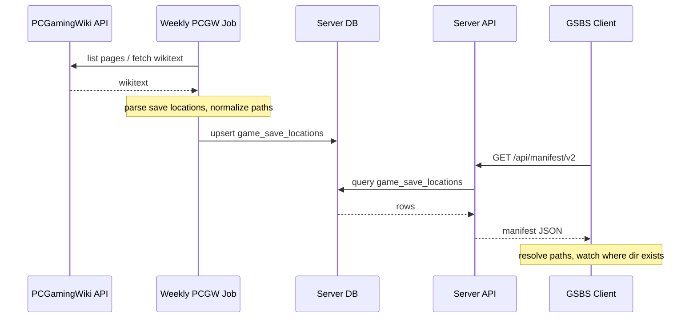

# How It Works

> Architecture, data model, sync flow, path keys, cross-OS sync, the PCGW integration, SSE events, and security model.

---

## Overview

GSBS has two main components:

- **Server** — Central service. Handles user auth, stores one copy of each save per user keyed by `(game_id, path_key)`. Exposes push/pull/list REST APIs and a WebUI.
- **Clients** — One process per machine (Windows or Linux). Resolve OS-specific save paths, watch only existing save directories, upload on file change, and pull on sync — writing only where the target folder exists.

```
┌─────────────────────────────────────────┐
│              GSBS Server                │
│  Auth · WebUI · Save storage · PCGW job │
└─────────────────────────────────────────┘
                      ▲
      ┌───────────────┼───────────────┐
      │               │               │
┌─────┴─────┐   ┌─────┴─────┐   ┌─────┴─────┐
│  Client   │   │  Client   │   │  Client   │
│ (Windows) │   │  (Linux)  │   │    …      │
└───────────┘   └───────────┘   └───────────┘
```

---

## Data model

### Server entities

| Entity | Key fields | Description |
|---|---|---|
| **Users** | `id`, `username`, password hash | One account per person |
| **Clients** | `id`, `user_id`, `name`, `os`, `last_seen`, token hash | Each registered client machine |
| **Saves** | `user_id`, `game_id`, `path_key`, `updated_at`, `content_hash` | One current version per `(user, game_id, path_key)` |
| **Save versions** | linked to saves | Last N versions (configurable; default 8) |
| **Game save locations** | `game_id`, `platform`, `path_template`, `save_rules_json` | PCGW manifest projection |
| **Job runs** | `job_name`, `started_at`, `status`, `entries_count` | PCGW sync job history |
| **Manifest fetches** | `client_id`, `fetched_at`, `entries_count` | Every manifest download logged |

### path_key

The `path_key` is the stable identifier for one logical save slot. It determines which server record a client reads and writes.

| Rule type | How `path_key` is derived | Cross-OS? |
|---|---|---|
| **PCGW-sourced rules** | `(game_id, slot_label, is_config)` — OS-neutral | Yes |
| **User-defined `watch_paths`** | Hash of the full rule definition | No (per-machine) |
| **Per-file slots** | `hash(rule_key + relative_path)` | Depends on rule source |

`slot_label` is an OS-neutral integer index assigned during PCGW ingest. Because it does not include path content, Windows and Linux clients produce the **same `path_key`** for the same logical save.

---

## Sync flow

### Upload (client → server)

1. File watcher detects a change in a monitored save directory.
2. Client debounces the event (2s), reads the file, computes SHA256.
3. If the hash matches the last successful push (local cache), skip.
4. Client sends `POST /api/saves` with the file bytes, `X-Game-ID`, `X-Path-Key`, `X-Relative-Path`, and `X-Content-Hash`.
5. Server checks against the stored hash. If unchanged, returns `{"status":"unchanged"}`.
6. Server writes the save: file bytes under `{GSBS_SAVE_ROOT}/{user_id}/{game_id}/…` (filesystem mode) or as an inline BLOB (legacy).
7. Server broadcasts a `save-updated` SSE event to other connected clients of the same user.

### Download (server → client)

1. Client calls `GET /api/saves?summaries=1` to get save metadata (no content).
2. For each entry where the server hash differs from local, the client downloads the full save.
3. For each downloaded save, the client resolves the OS-native path:
   - If the **target directory does not exist** → skip (game not installed — folder-exists rule).
   - If it exists → write the file (with optional `.gsbs.bak` backup first).
4. Client listens on `GET /api/events` (SSE) and immediately re-pulls on `save-updated` events from other machines.

### Startup reconciliation

On startup (after the initial pull), the client scans all local save files under watched directories and uploads any not yet on the server — independent of file-change events. Files already matching the server hash are skipped. This ensures saves are seeded on first install or after a server reset.

---

## Path resolution

Placeholders in PCGW path templates are resolved to real paths by the client:

| Placeholder | Resolves to |
|---|---|
| `%USERPROFILE%` | Windows user home |
| `%APPDATA%` | Windows Roaming AppData |
| `%LOCALAPPDATA%` | Windows Local AppData |
| `%PUBLIC%` | Windows public user folder |
| `<SteamLibrary-folder>` | Discovered Steam library root(s) |
| `<Ubisoft-Connect-folder>` | Ubisoft Connect install path |
| `<GOG-Galaxy-folder>` | GOG Galaxy install path |
| `<Epic-Games-folder>` | Epic Games install path |
| `<Xbox-App-folder>` | Xbox App install path |
| `<user-id>` | Launcher user ID (auto-detected) |
| `<game-install-folder>` | Per-game install directory |
| `xdgcachehome` | `$XDG_CACHE_HOME` or `~/.cache` on Linux |

**Folder-exists rule:** Before writing a pulled save, the client checks that the target directory exists. If missing, the save is skipped and the game is classified as `save_dir_missing`. The client never creates directories.

---

## PCGamingWiki integration

GSBS pulls game save locations from [PCGamingWiki](https://www.pcgamingwiki.com/) and stores them in a local DB.

### Sync flow (PCGW → Server)



**Two-phase sync:**
- **Phase 1:** Enumerate all PCGW game IDs into `pcgw_catalog` (incremental via `last_rev_id`).
- **Phase 2:** Fetch and parse wikitext for new/changed/failed pages. Interrupted runs save a checkpoint and resume on next run.

The sync runs weekly by default (Sunday 03:00). Configure via `GSBS_PCGW_CRON` or Admin → Settings.

### Manifest versions

| Version | Endpoint | Format |
|---|---|---|
| v1 (compat) | `GET /api/manifest` | Flat list of `GameSaveLocation` entries |
| v2 (preferred) | `GET /api/manifest/v2` | Per-game grouped with taxonomy, `save_locations`, `config_locations`, `proton_support_level` |

Clients try v2 first (with `If-None-Match` ETag caching); fall back to v1 on 404. Tray **Refresh manifest** forces a re-fetch.

---

## Server-Sent Events (SSE)

Clients connect to `GET /api/events` with their Bearer token for a long-lived event stream.

| Event | Scope | Meaning |
|---|---|---|
| `save-updated` | per-user | A save was pushed; other clients re-pull |
| `manifest-updated` | broadcast | PCGW manifest changed; clients re-fetch |
| `job-progress` | broadcast | PCGW sync job progress update |
| `job-finished` | broadcast | PCGW sync completed |
| `audit-updated` | broadcast | Admin audit log changed |
| `server-shutting-down` | broadcast | Server is about to stop |

SSE heartbeat (`: heartbeat`) is sent every 30 seconds. At most 5 concurrent SSE connections per user; oldest is evicted if exceeded. Clients auto-reconnect with exponential backoff (2s–60s cap).

---

## Watcher and retry

- **Save rules** (`pkg/saverule`): PCGW pipe/glob strings parse into `directory` + `include_patterns`. Example: `saves/*.sav|saves/*.dat` → watch `saves/`, upload only `*.sav` and `*.dat`.
- **Watcher supervisor:** Restarts fsnotify on failure, filters events by manifest patterns, removes stale paths on manifest refresh.
- **Outbox:** Failed pushes are queued with exponential backoff (2m–30m cap). Entries older than 7 days are dropped. Auth/quota errors are not retried.
- **Network retry:** `pkg/retry` backoff for pull, manifest fetch, SSE, and outbox.
- **Windows reliability:** fsnotify overflow triggers a full directory rescan. Locked files during push are enqueued to the outbox rather than dropped.

---

## Job runner

`server/job/runner.go` wraps job execution with:

- DB tracking via `job_runs` and `pcgw_sync_runs` tables.
- In-memory + DB dedup to prevent concurrent runs.
- Cancel and resume support.
- SSE broadcast on completion.
- On startup: stale `running` rows are reconciled to `interrupted`.

---

## Security model

| Concern | Approach |
|---|---|
| **Auth** | Per-user API tokens (SHA-256 hashed in DB). `Authorization: Bearer` only. |
| **Token expiry** | `GSBS_TOKEN_MAX_AGE` (default 90 days). |
| **Token revocation** | Password change and 2FA disable revoke all active tokens. |
| **Session cookies** | Signed with `GSBS_SESSION_SECRET`; `Secure` flag when over TLS. |
| **CSRF** | State-changing WebUI forms protected with a signed CSRF token. |
| **Rate limiting** | Per-IP for auth, per-user for push/pull/manifest. Returns 429. |
| **Data isolation** | Clients only access their own user's saves. |
| **E2E encryption** | Optional AES-GCM; passphrase never leaves the client. |
| **Headers** | X-Content-Type-Options, X-Frame-Options, Referrer-Policy, CSP, HSTS. |
| **Panic recovery** | Middleware catches panics, logs with request-ID, returns 500. |
| **Quota** | Fail-closed: storage byte errors return 503 instead of silently bypassing quota. |

---

## Database

SQLite in WAL mode. Key tables:

| Table | Purpose |
|---|---|
| `users`, `clients` | Auth and registration |
| `saves`, `save_versions` | Save data and version history |
| `game_save_locations` | PCGW manifest projection (v1) |
| `pcgw_games`, `pcgw_game_data`, `pcgw_*` | Full PCGW mirror |
| `pcgw_sync_runs` | PCGW sync job run history |
| `job_runs` | General job execution log |
| `manifest_fetches` | Per-client manifest download log |
| `admin_settings` | PCGW cron, filters, first-start config |
| `stats_snapshots` | Admin analytics time series |

---

## Related pages

- [Server Configuration](Server-Configuration)
- [Client Setup & Usage](Client-Setup-and-Usage)
- [API Reference](API-Reference)
- [Troubleshooting](Troubleshooting)
